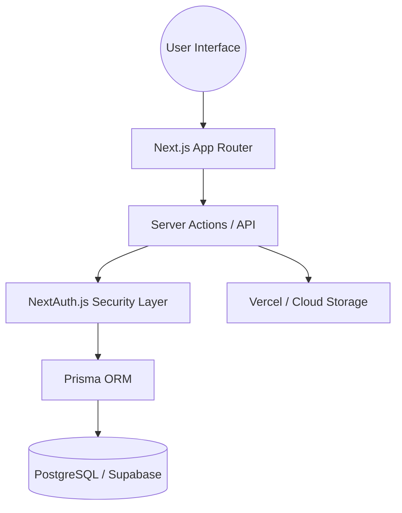

# 🎓 EduAkses: The Unified Learning Ecosystem
> **"Empowering Inclusive, Adaptive, and Seamless Education for Everyone."**

[](https://edu-akses.vercel.app/)
[](https://nextjs.org/)
[](https://www.typescriptlang.org/)
[](https://www.prisma.io/)
[](https://tailwindcss.com/)
[](https://dicoding.com)

---

## 📖 Overview
**EduAkses** adalah platform pembelajaran terpadu (Unified Learning Platform) yang dirancang untuk mengatasi fragmentasi alat pendidikan digital. Di era modern, pengajar dan siswa sering kali merasa kewalahan (app fatigue) karena harus berpindah-pindah antar aplikasi (Zoom, Google Classroom, Quizizz, dsb). 

EduAkses hadir sebagai **solusi satu atap** yang menyatukan manajemen kelas, komunikasi real-time, kuis adaptif, dan pelaporan akademik dalam satu ekosistem yang mulus dan aman.

---

## 🎯 The Vision

### 🔍 The Problem
Fragmentasi digital menyebabkan beban kognitif yang tinggi. Riset menunjukkan bahwa penggunaan terlalu banyak platform berbeda menurunkan fokus siswa hingga **40%** dan meningkatkan beban administratif pengajar secara signifikan.

### 💡 Our Solution
EduAkses menyederhanakan alur kerja pendidikan dengan mengintegrasikan:
1.  **LMS (Learning Management System):** Untuk distribusi materi dan tugas.
2.  **Communication Hub:** Chat dan Video Meet terintegrasi.
3.  **Adaptive Assessment:** Kuis pintar dengan umpan balik instan.
4.  **Academic Analytics:** Dashboard laporan yang mendalam bagi pengajar.

---

## ✨ Core Features & Modules

### 👨‍🎓 For Students (Pusat Pembelajaran)
*   **Unified Dashboard:** Lihat semua tugas, materi, dan pengumuman dalam satu tampilan.
*   **Real-time Collaboration:** Chat grup dan diskusi kelas tanpa perlu aplikasi luar.
*   **Adaptive Quizzes:** Sistem kuis yang menyesuaikan dengan progres belajar, dilengkapi timer dan skoring otomatis.
*   **Digital Workspace:** Ruang kerja khusus untuk proyek kelompok dan penyimpanan materi penting.
*   **Smart Reminders:** Notifikasi otomatis untuk tenggat waktu tugas.

### 👨‍🏫 For Teachers & Admins (Kendali Penuh)
*   **Dynamic Class Management:** Kontrol penuh atas pendaftaran siswa, pembagian materi, dan izin akses.
*   **Automated Grading:** Skoring otomatis yang akurat menggunakan Prisma ORM untuk integrasi database yang cepat.
*   **Secure Server Actions:** Pengumpulan tugas yang divalidasi di sisi server untuk mencegah kecurangan.
*   **Analytics Dashboard:** Pantau performa kelas melalui statistik visual dan ekspor data (PDF/CSV).
*   **Integrated Video Meet:** Lakukan pertemuan virtual langsung dari platform.

### 🧑‍✈️ For Class Leaders (Jembatan Komunikasi)
*   **Progress Tracking:** Memantau ritme belajar teman sekelas dan membantu koordinasi kelompok.
*   **Event Coordination:** Mengatur jadwal kelas tambahan atau diskusi kelompok.

---

## 🛠️ Technology Stack & Rationale

| Layer | Technology | Why? |
| :--- | :--- | :--- |
| **Framework** | **Next.js 15+ (App Router)** | Memungkinkan SEO yang kuat (SSR) dan performa tinggi dengan React Server Components. |
| **Language** | **TypeScript** | Menjamin skalabilitas kode dengan *type-safety* yang ketat, mengurangi bug di runtime. |
| **Styling** | **Tailwind CSS 4.0** | Desain yang sangat cepat, responsif, dan konsisten tanpa overhead CSS tradisional. |
| **ORM** | **Prisma** | Memberikan abstraksi database yang aman dan performa query yang dioptimalkan. |
| **Database** | **PostgreSQL (Supabase)** | Database relasional yang tangguh dengan fitur real-time dan koneksi serverless yang stabil. |
| **Auth** | **NextAuth.js v5 (Beta)** | Standar industri untuk otentikasi aman dengan dukungan berbagai provider dan session management. |
| **Animations** | **Framer Motion** | Memberikan pengalaman pengguna yang "premium" dengan transisi UI yang halus. |
| **Reporting** | **jsPDF & PapaParse** | Generasi laporan akademik (PDF) dan pengolahan data (CSV) langsung di sisi klien. |

---

## 🏗️ Architecture & Security

### 🔐 Security First
*   **Role-Based Access Control (RBAC):** Sistem perizinan berlapis untuk memastikan user hanya dapat mengakses data sesuai perannya (Admin, Guru, Ketua, Siswa).
*   **Custom Reverse Proxy:** Implementasi proxy khusus di `src/proxy.ts` untuk melindungi API endpoint dan menangani kebijakan CORS secara ketat.
*   **Zod Validation:** Semua input data divalidasi di sisi client dan server untuk mencegah SQL Injection dan Cross-Site Scripting (XSS).

### 📡 Data Flow (Mermaid)


---

## 📦 Getting Started

### 1. Prerequisites
- **Node.js** (v20 or later)
- **npm** or **pnpm**
- **PostgreSQL Instance** (Recommended: Supabase)

### 2. Installation
```bash
# Clone the repository
git clone https://github.com/4RBTR/EduAkses.git
cd eduakses

# Install dependencies
npm install

# Setup Environment Variables
cp .env.example .env
# Edit .env and add your DATABASE_URL, NEXTAUTH_SECRET, etc.

# Initialize Database & Prisma
npx prisma generate
npx prisma db push
```

### 3. Running the Development Server
```bash
npm run dev
```
Open [http://localhost:3000](http://localhost:3000) with your browser to see the result.

---

## 👥 The Excellence Team (CC26-PS057)

| Member | Expertise | Responsibility |
| :--- | :--- | :--- |
| **Almira Dwi Rosyadi** | UI/UX & PM | Product Design, User Flow, Project Coordination |
| **Danendra Bagas Himawan** | Full-Stack / BE | Database Schema, Auth Security, API Integration |
| **Sakti Mahayana Zaman** | Full-Stack / FE | UI Implementation, Client-side Logic, Animations |

---

## 🔑 Demo Access (Testing Accounts)

Untuk mempermudah review, silakan gunakan akun berikut:

### 🛡️ Administrator / Guru
| Role | Email Address | Password |
| :--- | :--- | :--- |
| **Guru (Sakti)** | `sakti.teacher@eduakses.com` | `GuruEdu123!` |
| **Guru (Almira)** | `almira.teacher@eduakses.com` | `GuruEdu123!` |
| **Ketua (Danendra)** | `danendra.leader@eduakses.com` | `Ketua123!` |

### 📖 Siswa (Student)
| Role | Email Address | Password |
| :--- | :--- | :--- |
| **Siswa (Bagas)** | `bagas.student@eduakses.com` | `Siswa123!` |
| **Siswa (Sakti)** | `sakti.student@eduakses.com` | `Siswa123!` |
| **Siswa (Almira)** | `almira.student@eduakses.com` | `Siswa123!` |

---

> [!IMPORTANT]
> Proyek ini dikembangkan dengan dedikasi penuh sebagai bagian dari **Coding Camp 2026 powered by DBS Foundation**. Kami berkomitmen untuk terus meningkatkan aksesibilitas pendidikan digital di Indonesia.

---
© 2026 EduAkses Team. Built with ❤️ and Modern Tech.
